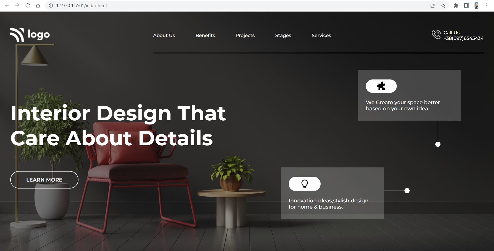

# Project 10: Interior Design Landing Page

   

### Name:

> `Anshul Ghogre`

## Key Learnings from the project

- _Learned About cards and in-depth flexbox properties._
- _Got experience with both HTML&CSS, as from this project, we have to do almost all things._

---

### Screenshots:-

---

> Time taken to complete this project: 5hrs

---

## [Live-Link](https://project-10-interior-design-landing-pg.netlify.app/)

---
